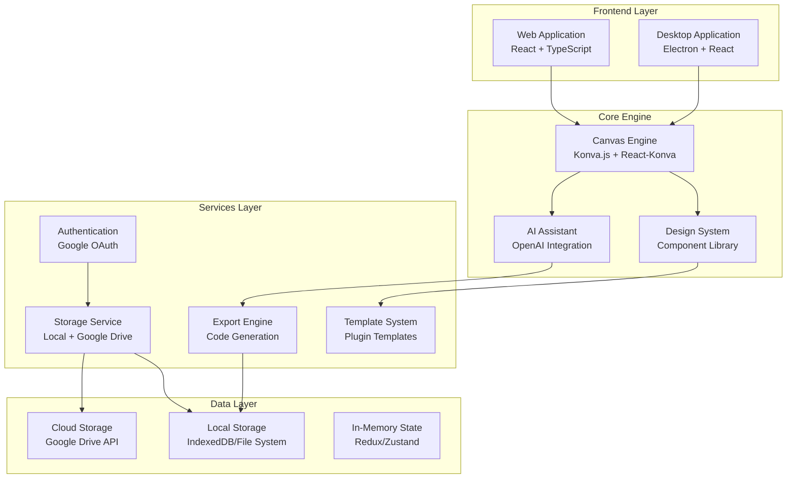

# Design Document

## Overview

The VST3 Interface Designer is a sophisticated cross-platform application that combines the power of modern web technologies with native desktop capabilities to create a comprehensive visual design tool for VST3 plugin interfaces. The application leverages a hybrid architecture supporting both web-based and desktop deployment, utilizing React for the user interface, Konva.js for canvas-based design operations, and Electron for desktop functionality.

The system is designed around a component-based architecture that separates concerns between the visual design engine, AI-powered assistance, project management, and export capabilities. This modular approach ensures scalability, maintainability, and the ability to extend functionality as the VST3 ecosystem evolves.

## Architecture

### High-Level Architecture



### Technology Stack

**Frontend Framework:**

- React 18+ with TypeScript for type safety and modern development
- React-Konva for declarative canvas operations and high-performance rendering
- Tailwind CSS for utility-first styling and rapid UI development
- Framer Motion for smooth animations and transitions

**Desktop Application:**

- Electron for cross-platform desktop deployment
- Native file system access for enhanced performance
- System integration capabilities (file associations, drag-and-drop)

**Canvas and Graphics:**

- Konva.js as the primary 2D canvas library for shape manipulation
- React-Konva for React integration and declarative canvas programming
- Custom VST3 component library built on top of Konva primitives

**State Management:**

- Zustand for lightweight, scalable state management
- React Query for server state management and caching
- Immer for immutable state updates

**Authentication and Storage:**

- Google OAuth 2.0 for user authentication
- Google Drive API for cloud storage and synchronization
- IndexedDB for local web storage
- Native file system for desktop application

**AI Integration:**

- OpenAI API for design suggestions and automated layout
- Custom prompt engineering for VST3-specific design patterns
- Image analysis for reference-based design generation

## Components and Interfaces

### Core Components

#### 1. Canvas Engine (`CanvasEngine`)

The canvas engine serves as the primary interface for all visual design operations, built on top of Konva.js for high-performance 2D graphics rendering.

```typescript
interface CanvasEngine {
  // Core canvas operations
  addComponent(component: VST3Component, position: Point): void;
  removeComponent(componentId: string): void;
  updateComponent(componentId: string, properties: ComponentProperties): void;
  
  // Selection and manipulation
  selectComponents(componentIds: string[]): void;
  moveComponents(componentIds: string[], delta: Point): void;
  resizeComponent(componentId: string, dimensions: Dimensions): void;
  
  // Layer management
  setComponentLayer(componentId: string, layer: number): void;
  getLayerComponents(layer: number): VST3Component[];
  
  // Canvas state
  getCanvasState(): CanvasState;
  setCanvasState(state: CanvasState): void;
  
  // Export operations
  exportToImage(format: 'png' | 'jpg' | 'svg'): Promise<Blob>;
  exportToCode(framework: CodeFramework): Promise<CodeExport>;
}
```

#### 2. VST3 Component Library (`VST3ComponentLibrary`)

A comprehensive library of VST3-specific interface components with standardized properties and behaviors.

```typescript
interface VST3Component {
  id: string;
  type: ComponentType;
  position: Point;
  dimensions: Dimensions;
  properties: ComponentProperties;
  style: ComponentStyle;
  constraints: ComponentConstraints;
}

enum ComponentType {
  KNOB = 'knob',
  SLIDER = 'slider',
  BUTTON = 'button',
  TOGGLE = 'toggle',
  LED_DISPLAY = 'led_display',
  WAVEFORM_DISPLAY = 'waveform_display',
  TEXT_LABEL = 'text_label',
  METER = 'meter',
  ENVELOPE_DISPLAY = 'envelope_display',
  KEYBOARD = 'keyboard'
}

interface ComponentProperties {
  // Common properties
  name: string;
  parameterIndex?: number;
  defaultValue?: number;
  minValue?: number;
  maxValue?: number;
  
  // Visual properties
  showValue: boolean;
  valueFormat: string;
  
  // Behavior properties
  sensitivity: number;
  snapToValue: boolean;
  
  // Component-specific properties
  [key: string]: any;
}
```

#### 3. AI Design Assistant (`AIDesignAssistant`)

Intelligent design assistance powered by OpenAI's API, providing contextual suggestions and automated design generation.

```typescript
interface AIDesignAssistant {
  // Design analysis and suggestions
  analyzeDesign(canvasState: CanvasState): Promise<DesignAnalysis>;
  suggestImprovements(analysis: DesignAnalysis): Promise<DesignSuggestion[]>;
  
  // Automated layout
  autoArrangeComponents(components: VST3Component[], constraints: LayoutConstraints): Promise<LayoutResult>;
  generateLayout(pluginType: PluginType, requirements: string[]): Promise<VST3Component[]>;
  
  // Style suggestions
  suggestColorScheme(referenceImage?: File): Promise<ColorScheme>;
  suggestTypography(pluginGenre: PluginGenre): Promise<TypographyScheme>;
  
  // Requirements analysis
  analyzeRequirements(requirementsFile: File): Promise<RequirementsAnalysis>;
  generateFromRequirements(analysis: RequirementsAnalysis): Promise<DesignTemplate>;
}
```

#### 4. Project Management System (`ProjectManager`)

Handles project lifecycle, versioning, and collaboration features.

```typescript
interface ProjectManager {
  // Project operations
  createProject(template?: ProjectTemplate): Promise<Project>;
  loadProject(projectId: string): Promise<Project>;
  saveProject(project: Project, location: StorageLocation): Promise<void>;
  deleteProject(projectId: string): Promise<void>;
  
  // Version control
  createVersion(projectId: string, description: string): Promise<ProjectVersion>;
  restoreVersion(projectId: string, versionId: string): Promise<void>;
  getVersionHistory(projectId: string): Promise<ProjectVersion[]>;
  
  // Collaboration
  shareProject(projectId: string, permissions: SharePermissions): Promise<ShareLink>;
  getSharedProjects(): Promise<SharedProject[]>;
  
  // Templates
  saveAsTemplate(project: Project, templateInfo: TemplateInfo): Promise<ProjectTemplate>;
  getTemplates(category?: TemplateCategory): Promise<ProjectTemplate[]>;
}
```

#### 5. Alignment and Layout Engine (`AlignmentEngine`)

Comprehensive alignment and layout system for professional interface design.

```typescript
interface AlignmentEngine {
  // Alignment operations
  alignComponents(componentIds: string[], alignment: AlignmentType): void;
  distributeComponents(componentIds: string[], distribution: DistributionType): void;
  
  // Grid and snap functionality
  enableGrid(gridSettings: GridSettings): void;
  snapToGrid(componentId: string): void;
  snapToComponent(sourceId: string, targetId: string, snapType: SnapType): void;
  
  // Precise positioning
  setExactPosition(componentId: string, position: ExactPosition): void;
  setExactDimensions(componentId: string, dimensions: ExactDimensions): void;
  
  // Layout management
  createGroup(componentIds: string[], groupName: string): ComponentGroup;
  ungroupComponents(groupId: string): void;
  setLayoutConstraints(componentId: string, constraints: LayoutConstraints): void;
  
  // Style guides and consistency
  applyStyleGuide(componentIds: string[], styleGuide: StyleGuide): void;
  validateLayout(canvasState: CanvasState): LayoutValidationResult[];
}

enum AlignmentType {
  LEFT = 'left',
  CENTER_HORIZONTAL = 'center_horizontal',
  RIGHT = 'right',
  TOP = 'top',
  CENTER_VERTICAL = 'center_vertical',
  BOTTOM = 'bottom'
}

enum DistributionType {
  HORIZONTAL_EQUAL = 'horizontal_equal',
  VERTICAL_EQUAL = 'vertical_equal',
  HORIZONTAL_SPACING = 'horizontal_spacing',
  VERTICAL_SPACING = 'vertical_spacing'
}

interface GridSettings {
  enabled: boolean;
  type: 'square' | 'isometric' | 'custom';
  size: number;
  subdivisions: number;
  color: string;
  opacity: number;
  snapDistance: number;
}

interface ExactPosition {
  x: number;
  y: number;
  units: 'px' | 'mm' | 'in' | 'pt';
}

interface LayoutConstraints {
  pinToLeft?: boolean;
  pinToRight?: boolean;
  pinToTop?: boolean;
  pinToBottom?: boolean;
  maintainAspectRatio?: boolean;
  minWidth?: number;
  maxWidth?: number;
  minHeight?: number;
  maxHeight?: number;
}
```

#### 6. Professional Design Generator (`DesignGenerator`)

AI-powered system for generating professional plugin designs inspired by industry leaders.

```typescript
interface DesignGenerator {
  // Design generation
  generateRandomDesign(category: PluginCategory, style: DesignStyle): Promise<GeneratedDesign>;
  generateFromReference(referencePlugins: string[], customizations: DesignCustomizations): Promise<GeneratedDesign>;
  
  // Style analysis
  analyzeIndustryPatterns(pluginCategory: PluginCategory): Promise<DesignPatternAnalysis>;
  getStylePresets(brand?: PluginBrand): Promise<StylePreset[]>;
  
  // Design validation
  validateDesignProfessionalism(design: GeneratedDesign): Promise<DesignValidationResult>;
  suggestImprovements(design: GeneratedDesign): Promise<DesignImprovement[]>;
  
  // Pattern library
  getDesignPatterns(filters: PatternFilters): Promise<DesignPattern[]>;
  analyzeSuccessfulDesigns(pluginNames: string[]): Promise<DesignAnalysis[]>;
}

enum PluginCategory {
  SYNTHESIZER = 'synthesizer',
  EQ = 'eq',
  COMPRESSOR = 'compressor',
  REVERB = 'reverb',
  DELAY = 'delay',
  DISTORTION = 'distortion',
  FILTER = 'filter',
  MODULATION = 'modulation',
  UTILITY = 'utility'
}

enum DesignStyle {
  MODERN_CLEAN = 'modern_clean',
  VINTAGE_ANALOG = 'vintage_analog',
  FUTURISTIC_DIGITAL = 'futuristic_digital',
  MINIMAL_PROFESSIONAL = 'minimal_professional',
  DARK_THEME = 'dark_theme',
  COLORFUL_CREATIVE = 'colorful_creative'
}

enum PluginBrand {
  NATIVE_INSTRUMENTS_INSPIRED = 'native_instruments_inspired',
  ARTURIA_INSPIRED = 'arturia_inspired',
  UHE_INSPIRED = 'uhe_inspired',
  XFER_INSPIRED = 'xfer_inspired',
  FABFILTER_INSPIRED = 'fabfilter_inspired',
  WAVES_INSPIRED = 'waves_inspired'
}

interface GeneratedDesign {
  id: string;
  category: PluginCategory;
  style: DesignStyle;
  components: VST3Component[];
  colorScheme: ColorScheme;
  typography: TypographyScheme;
  layout: LayoutStructure;
  designPrinciples: DesignPrinciple[];
  inspirationSources: string[];
}

interface DesignPattern {
  id: string;
  name: string;
  category: PluginCategory;
  description: string;
  layoutStructure: LayoutStructure;
  colorPalette: ColorPalette;
  componentArrangement: ComponentArrangement;
  usageFrequency: number;
  successMetrics: SuccessMetrics;
}

interface DesignPrinciple {
  principle: string;
  application: string;
  visualExample: string;
  reasoning: string;
}
```

#### 7. Shell Design Engine (`ShellDesignEngine`)

Creative shell design generation and customization system.

```typescript
interface ShellDesignEngine {
  // Shell generation
  generateShellDesign(style: ShellStyle, options: ShellGenerationOptions): Promise<ShellDesign>;
  generateIntegratedDesign(interiorDesign: Project, shellPreferences: ShellPreferences): Promise<IntegratedDesign>;
  
  // Shell customization
  customizeShellShape(shellId: string, shape: ShellShape): void;
  applyShellTexture(shellId: string, texture: ShellTexture): void;
  setShellDimensions(shellId: string, dimensions: ShellDimensions): void;
  
  // 3D preview
  generate3DPreview(shell: ShellDesign, environment: DAWEnvironment): Promise<Preview3D>;
  renderShellInContext(shell: ShellDesign, hostStyle: HostStyle): Promise<ContextRender>;
  
  // Integration
  validateShellIntegration(shell: ShellDesign, interior: Project): ValidationResult;
  suggestShellModifications(interior: Project): ShellSuggestion[];
}

enum ShellStyle {
  MODERN_GLASS = 'modern_glass',
  VINTAGE_HARDWARE = 'vintage_hardware',
  FUTURISTIC_DIGITAL = 'futuristic_digital',
  ORGANIC_CURVES = 'organic_curves',
  GEOMETRIC_PATTERNS = 'geometric_patterns',
  MINIMALIST_FRAME = 'minimalist_frame'
}

enum ShellShape {
  RECTANGULAR = 'rectangular',
  ROUNDED_RECTANGLE = 'rounded_rectangle',
  HEXAGONAL = 'hexagonal',
  CIRCULAR = 'circular',
  CUSTOM_CURVE = 'custom_curve',
  ASYMMETRIC = 'asymmetric'
}

interface ShellDesign {
  id: string;
  style: ShellStyle;
  shape: ShellShape;
  dimensions: ShellDimensions;
  materials: ShellMaterial[];
  textures: ShellTexture[];
  colorScheme: ColorScheme;
  edgeTreatment: EdgeTreatment;
  shadowSettings: ShadowSettings;
}
```

#### 8. Color Management System (`ColorManager`)

Comprehensive color editing and theme management system.

```typescript
interface ColorManager {
  // Global color editing
  updateGlobalColors(colorMap: GlobalColorMap): void;
  applyColorTheme(theme: ColorTheme, scope: ColorScope): void;
  
  // Theme management
  getThemesByCategory(category: ThemeCategory): Promise<ColorTheme[]>;
  createCustomTheme(baseColors: ColorPalette, harmonyRule: HarmonyRule): Promise<ColorTheme>;
  saveThemePreset(theme: ColorTheme, name: string): Promise<void>;
  
  // Color analysis
  analyzeColorHarmony(colors: string[]): HarmonyAnalysis;
  validateAccessibility(foreground: string, background: string): AccessibilityResult;
  generateColorVariations(baseColor: string, count: number): string[];
  
  // Real-time preview
  previewColorChanges(changes: ColorChange[]): PreviewResult;
  applyColorChanges(changes: ColorChange[]): void;
}

enum ThemeCategory {
  MOOD_DARK = 'mood_dark',
  MOOD_LIGHT = 'mood_light',
  GENRE_ELECTRONIC = 'genre_electronic',
  GENRE_VINTAGE = 'genre_vintage',
  GENRE_CLASSICAL = 'genre_classical',
  BRAND_INSPIRED = 'brand_inspired'
}

enum HarmonyRule {
  COMPLEMENTARY = 'complementary',
  TRIADIC = 'triadic',
  ANALOGOUS = 'analogous',
  SPLIT_COMPLEMENTARY = 'split_complementary',
  TETRADIC = 'tetradic',
  MONOCHROMATIC = 'monochromatic'
}

interface ColorTheme {
  id: string;
  name: string;
  category: ThemeCategory;
  primaryColors: ColorPalette;
  accentColors: ColorPalette;
  backgroundColors: ColorPalette;
  textColors: ColorPalette;
  harmonyRule: HarmonyRule;
  accessibilityCompliant: boolean;
}
```

#### 9. Typography and Wording System (`TypographyManager`)

Professional typography and terminology management system.

```typescript
interface TypographyManager {
  // Typography themes
  getTypographyThemes(category: TypographyCategory): Promise<TypographyTheme[]>;
  applyTypographyTheme(theme: TypographyTheme, scope: TypographyScope): void;
  createCustomTypographyTheme(fonts: FontSelection, hierarchy: FontHierarchy): Promise<TypographyTheme>;
  
  // Wording and terminology
  getTerminologySet(pluginType: PluginCategory): Promise<TerminologySet>;
  applyWordingTheme(theme: WordingTheme): void;
  validateTerminologyConsistency(project: Project): ConsistencyReport;
  
  // Font management
  validateFontLicensing(fonts: string[]): LicensingReport;
  suggestWebSafeFonts(originalFonts: string[]): FontSuggestion[];
  optimizeFontSizing(text: string, container: Dimensions, targetReadability: number): FontOptimization;
}

enum TypographyCategory {
  MODERN_CLEAN = 'modern_clean',
  VINTAGE_ANALOG = 'vintage_analog',
  FUTURISTIC_TECH = 'futuristic_tech',
  PROFESSIONAL_STUDIO = 'professional_studio',
  CREATIVE_ARTISTIC = 'creative_artistic'
}

interface TypographyTheme {
  id: string;
  name: string;
  category: TypographyCategory;
  primaryFont: FontDefinition;
  secondaryFont: FontDefinition;
  accentFont: FontDefinition;
  hierarchy: FontHierarchy;
  spacing: SpacingRules;
  licensing: LicensingInfo;
}

interface WordingTheme {
  id: string;
  name: string;
  pluginType: PluginCategory;
  terminology: TerminologyMap;
  namingConventions: NamingConvention[];
  abbreviations: AbbreviationMap;
  tooltipStyle: TooltipStyle;
}
```

#### 10. Export Engine (`ExportEngine`)

Comprehensive export system supporting multiple frameworks and formats.

```typescript
interface ExportEngine {
  // Code export
  exportJUCE(project: Project, options: JUCEExportOptions): Promise<CodePackage>;
  exportiPlug2(project: Project, options: iPlug2ExportOptions): Promise<CodePackage>;
  exportWebAudio(project: Project, options: WebAudioExportOptions): Promise<CodePackage>;
  
  // Asset export
  exportAssets(project: Project, format: AssetFormat): Promise<AssetPackage>;
  exportImages(components: VST3Component[], resolution: number): Promise<ImageAsset[]>;
  
  // Documentation export
  exportDocumentation(project: Project, format: DocumentationFormat): Promise<DocumentationPackage>;
  
  // Integration helpers
  generateKiroIntegration(project: Project): Promise<KiroIntegrationPackage>;
  generateCursorIntegration(project: Project): Promise<CursorIntegrationPackage>;
}
```

### User Interface Components

#### 1. Main Design Canvas (`DesignCanvas`)

The primary workspace where users create and manipulate VST3 interface designs.

```typescript
interface DesignCanvasProps {
  project: Project;
  selectedComponents: string[];
  onComponentSelect: (componentIds: string[]) => void;
  onComponentUpdate: (componentId: string, properties: ComponentProperties) => void;
  onCanvasUpdate: (canvasState: CanvasState) => void;
}
```

#### 2. Component Palette (`ComponentPalette`)

Categorized library of available VST3 components for drag-and-drop placement.

```typescript
interface ComponentPaletteProps {
  categories: ComponentCategory[];
  searchQuery: string;
  onComponentDrag: (componentType: ComponentType) => void;
  onSearch: (query: string) => void;
}
```

#### 3. Properties Panel (`PropertiesPanel`)

Dynamic property editor that adapts to selected component types.

```typescript
interface PropertiesPanelProps {
  selectedComponents: VST3Component[];
  onPropertyChange: (componentId: string, property: string, value: any) => void;
  onStyleChange: (componentId: string, style: ComponentStyle) => void;
}
```

#### 4. AI Assistant Panel (`AIAssistantPanel`)

Interactive AI assistant interface for design suggestions and automation.

```typescript
interface AIAssistantPanelProps {
  currentProject: Project;
  onSuggestionApply: (suggestion: DesignSuggestion) => void;
  onLayoutGenerate: (layout: LayoutResult) => void;
  onRequirementsUpload: (file: File) => void;
}
```

#### 5. Alignment Toolbar (`AlignmentToolbar`)

Comprehensive alignment and layout tools for professional design precision.

```typescript
interface AlignmentToolbarProps {
  selectedComponents: string[];
  gridSettings: GridSettings;
  onAlign: (alignment: AlignmentType) => void;
  onDistribute: (distribution: DistributionType) => void;
  onGridToggle: (enabled: boolean) => void;
  onSnapSettingsChange: (settings: SnapSettings) => void;
  onExactPositioning: (componentId: string, position: ExactPosition) => void;
}
```

#### 6. Layer Management Panel (`LayerPanel`)

Advanced layer and grouping management for complex designs.

```typescript
interface LayerPanelProps {
  layers: Layer[];
  groups: ComponentGroup[];
  selectedComponents: string[];
  onLayerVisibilityToggle: (layerId: string) => void;
  onLayerLock: (layerId: string, locked: boolean) => void;
  onLayerReorder: (layerId: string, newIndex: number) => void;
  onGroupCreate: (componentIds: string[], groupName: string) => void;
  onGroupUngroup: (groupId: string) => void;
}
```

#### 7. Layout Inspector (`LayoutInspector`)

Precise positioning and dimension controls with numeric inputs.

```typescript
interface LayoutInspectorProps {
  selectedComponent: VST3Component | null;
  units: 'px' | 'mm' | 'in' | 'pt';
  onPositionChange: (position: ExactPosition) => void;
  onDimensionChange: (dimensions: ExactDimensions) => void;
  onRotationChange: (rotation: number) => void;
  onConstraintsChange: (constraints: LayoutConstraints) => void;
}
```

#### 8. Design Generator Panel (`DesignGeneratorPanel`)

Professional design generation interface with industry-inspired options.

```typescript
interface DesignGeneratorPanelProps {
  onDesignGenerate: (options: GenerationOptions) => void;
  onStylePresetSelect: (preset: StylePreset) => void;
  onReferenceAnalyze: (pluginNames: string[]) => void;
  availableCategories: PluginCategory[];
  availableStyles: DesignStyle[];
  brandPresets: PluginBrand[];
}

interface GenerationOptions {
  category: PluginCategory;
  style: DesignStyle;
  brandInspiration?: PluginBrand;
  colorSchemePreference?: ColorSchemeType;
  complexityLevel: 'simple' | 'moderate' | 'complex';
  includeCharacter?: boolean;
  customConstraints?: DesignConstraints;
}
```

#### 9. Pattern Library Browser (`PatternLibraryBrowser`)

Browse and analyze successful plugin design patterns.

```typescript
interface PatternLibraryBrowserProps {
  patterns: DesignPattern[];
  selectedCategory: PluginCategory | null;
  onPatternSelect: (pattern: DesignPattern) => void;
  onPatternApply: (pattern: DesignPattern, customizations: PatternCustomizations) => void;
  onAnalysisView: (pattern: DesignPattern) => void;
  searchQuery: string;
  onSearch: (query: string) => void;
}
```

#### 10. Design Analysis Viewer (`DesignAnalysisViewer`)

Detailed analysis of design principles and patterns in successful plugins.

```typescript
interface DesignAnalysisViewerProps {
  analysis: DesignAnalysis;
  comparisonPlugins?: string[];
  onPrincipleHighlight: (principle: DesignPrinciple) => void;
  onPatternExtract: (pattern: DesignPattern) => void;
  showAnnotations: boolean;
  onAnnotationToggle: (show: boolean) => void;
}
```

#### 11. Shell Design Panel (`ShellDesignPanel`)

Creative shell design and customization interface.

```typescript
interface ShellDesignPanelProps {
  currentShell: ShellDesign | null;
  designMode: 'interior' | 'exterior' | 'integrated';
  onShellGenerate: (style: ShellStyle, options: ShellGenerationOptions) => void;
  onShapeCustomize: (shape: ShellShape, parameters: ShapeParameters) => void;
  onMaterialApply: (material: ShellMaterial) => void;
  on3DPreview: (environment: DAWEnvironment) => void;
  availableStyles: ShellStyle[];
  availableShapes: ShellShape[];
}
```

#### 12. Color Theme Manager (`ColorThemeManager`)

Comprehensive color editing and theme selection interface.

```typescript
interface ColorThemeManagerProps {
  currentTheme: ColorTheme | null;
  availableThemes: ColorTheme[];
  themeCategories: ThemeCategory[];
  onThemeSelect: (theme: ColorTheme) => void;
  onColorEdit: (colorMap: GlobalColorMap) => void;
  onCustomThemeCreate: (baseColors: ColorPalette, harmonyRule: HarmonyRule) => void;
  onAccessibilityCheck: (foreground: string, background: string) => void;
  showRealTimePreview: boolean;
  onPreviewToggle: (show: boolean) => void;
}
```

#### 13. Typography and Wording Panel (`TypographyPanel`)

Professional typography and terminology management interface.

```typescript
interface TypographyPanelProps {
  currentTypography: TypographyTheme | null;
  currentWording: WordingTheme | null;
  availableTypographyThemes: TypographyTheme[];
  availableWordingThemes: WordingTheme[];
  pluginType: PluginCategory;
  onTypographyThemeSelect: (theme: TypographyTheme) => void;
  onWordingThemeSelect: (theme: WordingTheme) => void;
  onCustomTypographyCreate: (fonts: FontSelection, hierarchy: FontHierarchy) => void;
  onTerminologyValidate: () => void;
  onFontLicenseCheck: (fonts: string[]) => void;
}
```

#### 14. Integrated Design Workflow (`IntegratedDesignWorkflow`)

Unified interface for interior-exterior design coordination.

```typescript
interface IntegratedDesignWorkflowProps {
  designMode: 'interior' | 'exterior' | 'integrated';
  interiorDesign: Project | null;
  exteriorShell: ShellDesign | null;
  onModeSwitch: (mode: 'interior' | 'exterior' | 'integrated') => void;
  onDesignSync: () => void;
  onHarmonyCheck: () => void;
  onSuggestionApply: (suggestion: DesignSuggestion) => void;
  showConsistencyIndicators: boolean;
  onConsistencyToggle: (show: boolean) => void;
}
```

## Data Models

### Project Structure

```typescript
interface Project {
  id: string;
  name: string;
  description: string;
  version: string;
  createdAt: Date;
  updatedAt: Date;
  
  // Design data
  canvasState: CanvasState;
  components: VST3Component[];
  
  // Metadata
  pluginType: PluginType;
  targetFrameworks: CodeFramework[];
  tags: string[];
  
  // Settings
  canvasSettings: CanvasSettings;
  exportSettings: ExportSettings;
  
  // Collaboration
  owner: string;
  collaborators: Collaborator[];
  shareSettings: ShareSettings;
}

interface CanvasState {
  dimensions: Dimensions;
  backgroundColor: string;
  backgroundImage?: string;
  zoom: number;
  pan: Point;
  gridSettings: GridSettings;
  snapSettings: SnapSettings;
}

interface CanvasSettings {
  showGrid: boolean;
  showRulers: boolean;
  snapToGrid: boolean;
  snapToComponents: boolean;
  gridSize: number;
  units: 'px' | 'mm' | 'in';
}
```

### Component Styling System

```typescript
interface ComponentStyle {
  // Visual appearance
  fill: FillStyle;
  stroke: StrokeStyle;
  shadow: ShadowStyle;
  
  // Typography (for text components)
  font: FontStyle;
  
  // Effects
  effects: EffectStyle[];
  
  // Animation
  animations: AnimationStyle[];
}

interface FillStyle {
  type: 'solid' | 'gradient' | 'pattern' | 'image';
  color?: string;
  gradient?: GradientStyle;
  pattern?: PatternStyle;
  image?: ImageStyle;
}

interface GradientStyle {
  type: 'linear' | 'radial' | 'conic';
  stops: ColorStop[];
  angle?: number;
  center?: Point;
}
```

## Error Handling

### Error Categories

1. **Canvas Errors**: Issues with rendering, component manipulation, or canvas state
2. **Storage Errors**: Problems with saving, loading, or synchronizing projects
3. **Export Errors**: Failures in code generation or asset export
4. **AI Service Errors**: API failures or invalid responses from AI services
5. **Authentication Errors**: OAuth failures or permission issues

### Error Handling Strategy

```typescript
interface ErrorHandler {
  handleCanvasError(error: CanvasError): void;
  handleStorageError(error: StorageError): void;
  handleExportError(error: ExportError): void;
  handleAIServiceError(error: AIServiceError): void;
  handleAuthError(error: AuthError): void;
}

class GlobalErrorHandler implements ErrorHandler {
  // Centralized error logging
  private logError(error: AppError): void {
    console.error(`[${error.category}] ${error.message}`, error);
    // Send to error tracking service
  }
  
  // User-friendly error display
  private showUserError(error: AppError): void {
    // Display appropriate error message to user
    // Provide recovery suggestions when possible
  }
  
  // Automatic recovery attempts
  private attemptRecovery(error: AppError): boolean {
    switch (error.category) {
      case 'storage':
        return this.attemptStorageRecovery(error as StorageError);
      case 'ai_service':
        return this.attemptAIServiceRecovery(error as AIServiceError);
      default:
        return false;
    }
  }
}
```

## Testing Strategy

### Unit Testing

- **Component Testing**: Individual VST3 components and their properties
- **Canvas Operations**: Drag-and-drop, selection, and manipulation functions
- **Export Functions**: Code generation and asset export accuracy
- **AI Integration**: Mock AI responses and suggestion processing

### Integration Testing

- **Canvas-Component Integration**: Proper rendering and interaction of components on canvas
- **Storage Integration**: Save/load operations across different storage backends
- **Authentication Flow**: Complete OAuth flow and permission handling
- **Export Pipeline**: End-to-end export process validation

### End-to-End Testing

- **Complete Workflow**: From project creation to export
- **Cross-Platform**: Testing on web and desktop versions
- **Collaboration**: Multi-user project editing and sharing
- **Performance**: Large project handling and canvas performance

### Testing Tools

```typescript
// Jest for unit testing
describe('VST3Component', () => {
  test('should create component with default properties', () => {
    const component = new VST3Component(ComponentType.KNOB);
    expect(component.properties.defaultValue).toBe(0.5);
  });
});

// React Testing Library for component testing
test('DesignCanvas renders components correctly', () => {
  render(<DesignCanvas project={mockProject} />);
  expect(screen.getByTestId('design-canvas')).toBeInTheDocument();
});

// Playwright for E2E testing
test('complete design workflow', async ({ page }) => {
  await page.goto('/');
  await page.click('[data-testid="new-project"]');
  await page.dragAndDrop('[data-testid="knob-component"]', '[data-testid="canvas"]');
  await page.click('[data-testid="export-button"]');
  // Verify export completion
});
```

### Performance Testing

- **Canvas Performance**: Rendering performance with large numbers of components
- **Memory Usage**: Memory consumption during extended design sessions
- **Export Performance**: Time to generate code for complex designs
- **Startup Time**: Application initialization time for both web and desktop versions

The testing strategy ensures reliability across all platforms and use cases, with particular attention to the unique challenges of canvas-based applications and cross-platform deployment.
